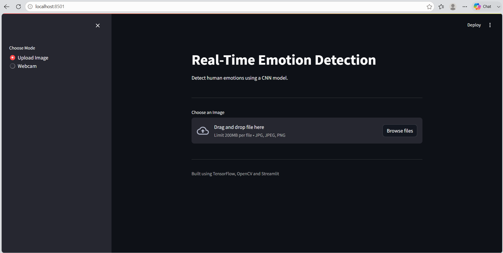
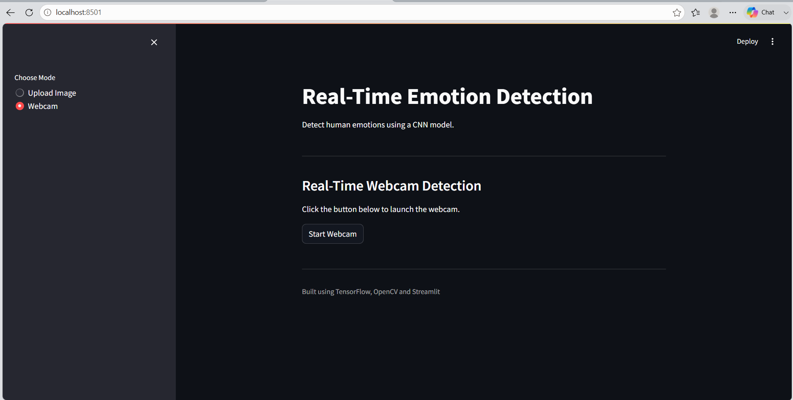

# Real-Time Emotion Detection using CNN

A Deep Learning project that detects human facial emotions using a Convolutional Neural Network (CNN). The model is trained on the FER-2013 dataset and can predict emotions from uploaded images as well as perform real-time emotion detection using a webcam with OpenCV.

---

## Overview

This project uses a CNN model to classify facial expressions into seven emotion categories. It includes:

- Image-based emotion prediction
- Real-time webcam emotion detection
- Streamlit web application
- OpenCV integration
- Model evaluation using confusion matrix and classification report

---

## Features

- Detects seven facial emotions
- Image upload using Streamlit
- Real-time webcam emotion detection
- CNN model built using TensorFlow/Keras
- Prediction confidence score
- Confusion Matrix and Classification Report
- Clean and modular project structure

---

## Emotion Classes

- Angry
- Disgust
- Fear
- Happy
- Neutral
- Sad
- Surprise

---

## Technologies Used

| Category | Technology |
|----------|------------|
| Programming Language | Python |
| Deep Learning | TensorFlow, Keras |
| Computer Vision | OpenCV |
| Web Framework | Streamlit |
| Data Processing | NumPy |
| Visualization | Matplotlib |
| Machine Learning | Scikit-learn |

---

# Screenshots

## Upload Image



---

## Webcam Page




---

# Project Structure

```text
Real-time Emotion Detection
│
├── app/
│   ├── app.py
│   ├── predict.py
│   └── webcam.py
│
├── assets/
│   └── screenshots/
│       ├── home.png
│       └── prediction.png
│
├── data/
│   ├── train/
│   └── test/
│
├── models/
│   └── emotion_model.keras
│
├── notebooks/
│   ├── 01_Data_Preparation.ipynb
│   ├── 02_CNN_Model.ipynb
│   ├── 03_Model_Training.ipynb
│   └── 04_Model_Evaluation.ipynb
│
├── .gitignore
├── LICENSE
├── README.md
└── requirements.txt
```

---

# CNN Architecture

```text
Input Image (48 × 48 × 1)

↓

Conv2D (32 Filters)

↓

MaxPooling

↓

Conv2D (64 Filters)

↓

MaxPooling

↓

Conv2D (128 Filters)

↓

MaxPooling

↓

Flatten

↓

Dense (128)

↓

Dropout (0.5)

↓

Dense (7)

↓

Softmax
```

---

# Model Performance

| Metric | Value |
|--------|-------|
| Training Accuracy | ~65% |
| Test Accuracy | ~56% |

*Results may vary depending on training parameters and hardware.*

---

# Dataset

Dataset Used: **FER-2013 (Facial Expression Recognition 2013)**

Download the dataset from Kaggle:

https://www.kaggle.com/datasets/msambare/fer2013

After downloading, place the dataset inside:

```text
data/
│
├── train/
└── test/
```

---

# Installation

Clone the repository

```bash
git clone https://github.com/VinitaPatil2005/Real-time-Emotion-Detection.git
```

Move to the project directory

```bash
cd Real-time-Emotion-Detection
```

Install the required packages

```bash
pip install -r requirements.txt
```

---

# Run the Application

### Streamlit Application

```bash
streamlit run app/app.py
```

### Webcam Detection

```bash
python app/webcam.py
```

---

# Workflow

```text
Dataset

↓

Data Preparation

↓

CNN Model Building

↓

Model Training

↓

Model Evaluation

↓

Prediction Module

↓

Streamlit Application

↓

Real-Time Webcam Detection
```

---

# Future Enhancements

- Improve model accuracy using Transfer Learning
- Support live webcam inside Streamlit
- Deploy the application on Streamlit Cloud
- Improve prediction speed
- Enhance user interface

---

# Author

**Vinita Patil**

Bachelor of Engineering (Artificial Intelligence and Machine Learning)

GitHub:  
https://github.com/VinitaPatil2005

LinkedIn:  
https://www.linkedin.com/in/vinita-patil-a87052303/

---

If you found this project useful, consider starring the repository.
